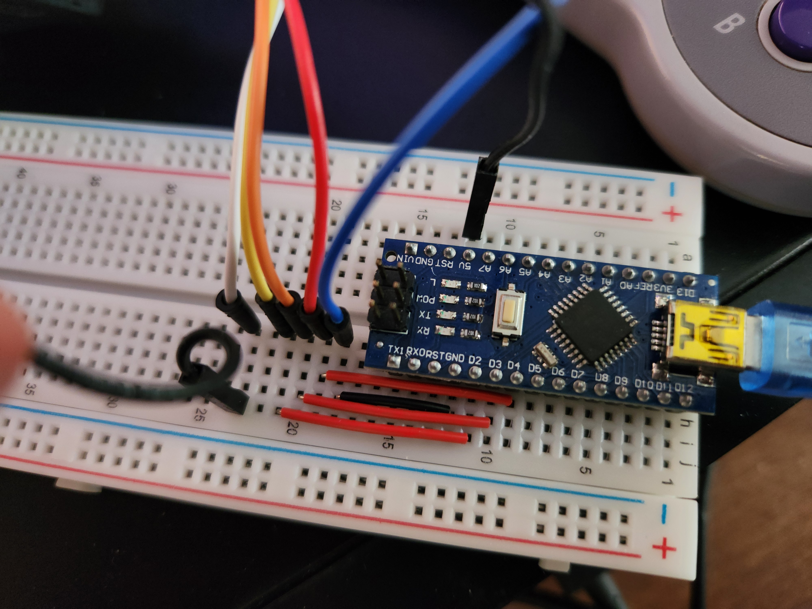
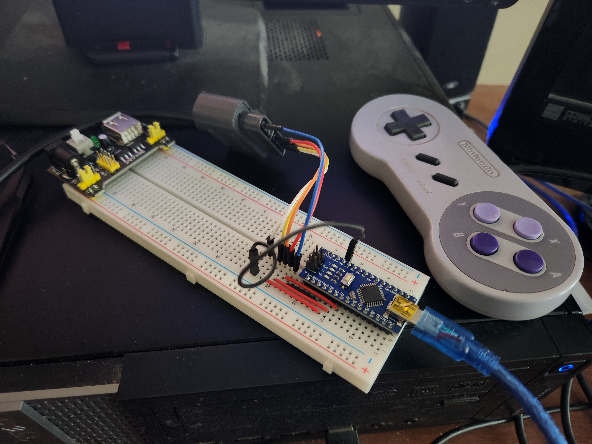

## SNES Controller Protocol

The Super Nintendo Entertainment System controller port contains 7 pins in two groups. Four pins, a separation, and then
three pins.

|-_-_-_-_-_-_-_-_-_-_-_-_-_-_-_-_-_-_-_-_-_-_-_-_-_-_-_-_-_-_-_-_\  
| (0) (1) (2) (3) \\ (4) (5) (6) | 
|-_-_-_-_-_-_-_-_-_-_-_-_-_-_-_-_-_-_-_-_-_-_-_-_-_-_-_-_-_-_-_-_/

*This is a diagram of the physical port of the SNES controller.*

| Pin | Description | Color  |
|-----|-------------|--------|
| 0   | +5V         | White  |
| 1   | Clock       | Yellow |
| 2   | Latch       | Orange |
| 3   | Data        | Red    |
| 4   | *Unused*    | *N/A*  |
| 5   | *Unused*    | *N/A*  |
| 6   | GND         | Blue   |

By connecting an Arduino Nano's +5V, GND, D2 (clock), D3 (latch), and D4 (data), to the SNES controller port via a male
to male jumper cable we can program the Arduino to accept SNES Controller input, and then send it to the computer for
further processing.

1. Originally, the SNES console would raise latch to HIGH, delay for 12 µs, and then lower latch to LOW, indicating the
   SNES controller to save all input states in an internal register to later pull the data. Before the data can be
   pulled, an additional 6 µs is waited to give the controller time to save this information. This behavior is emulated
   for each read iteration of the SNES controller.
2. Next, the SNES console would continuously pop each data bit one by one from the 16-bit register onto the data line,
   until all the data has been read, and the inputs have been accounted for. After latching, the first data bit would be
   popped, and a clock signal raised to HIGH, a 6 µs delay, and then lowered to LOW, with another 6 µs delay. This
   process is emulated after latching to read all 16 bits from the controller register.

The described behavior can be seen in `adapter.cpp`, where a uint16_t is built in reverse popping order, and returned by
a `readSNESController()` method.

These reads are repeated approximately every 16.67 ms on the original SNES console, (as it operated at 60 Hz,) however
this read operation repeats every 16 ms, slightly faster which shouldn't create any problems.

## Driver behavior

Once the uint16_t input from the SNES controller is gathered, it is sent via the Arduino USB to the computer, where it
is read via serial input by the `SNESControllerDriver`. Its behavior is captured in `driver.cpp`.

When the driver is ran, a command-line is shown. If no errors are shown, it means that the serial bus was properly
connected to a usb port, and is (presumably) accepting the data from the Arduino. The user may choose to exit and
shutdown the driver if they type either of the terminators into the
command-line ( `{ "exit", "quit", "terminate", "close", "stop", "shutdown" }` ).

When SNES controller inputs are sent, the keystrokes according to the mapping below are emulated, where if you hold a
button, it's held, and if you release, it is released.

| Putton | Emulated Keystroke |
|--------|--------------------|
| B      | 'b'                |
| A      | 'a'                |
| Select | 'e'                |
| Start  | 'm'                |
| Up     | 'w'                |
| Down   | 's'                |
| Left   | left arrow         |
| Right  | right arrow        |
| A      | 'a'                |
| X      | 'x'                |
| L      | 'l'                |
| R      | 'r'                |

There is currently no Windows or MacOS port for this keystroke emulation. The current driver software utilizes the `linux/uinput.h` header, and can thus only be ran on a Linux system.

The select inputs for the SNES controller are also not fully functional, as the data being received for the select input bit was alternating between 0 and 1, and this behavior is not captured in the driver. The start input may or may not alternate the same, and may not work properly either. All other SNES Controller inputs are captured properly within the scope of the driver.

## Discussion and Personal Reflection

This was a pretty fun little electrical and programming project over the course of the past two days. When I first got the idea, I couldn't get it off my mind, so I finally got around to doing it since it seemed like a good learning opportunity, which it was. I've learnt about the SNES controller protocol, and data, clock, latch data transfer protocols in general. I also researched the USB protocol, and it's very interesting. I learnt to read data from serial ports, and emulate keyboard inputs, as well as further advance my C++ code, although I will admit the code in this project could definitely be better in a few ways. I will say, however, that this project has furthered my understanding of computing, electronics. Continuing on, I definitely want to look into more SNES programming and NES programming, because the tricks that those developers used in their hardware limitations are akin to how a real computer scientist needs to think through problems. And now that computers have gotten so much better, programmers often neglect this side of the picture, which is why many modern programs run so terribly. But learning about the hardware side of how computers process instructions is what computing was birthed from, and it's ultimately what it's all about.

